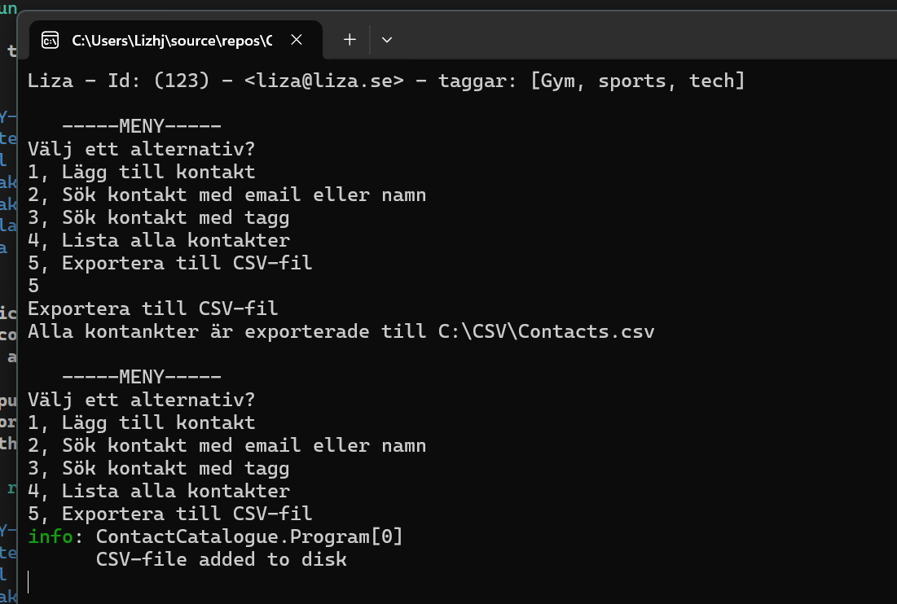

# ContactCatalogue

## How to run

Starting up the program brings up the following menu:

```
   -----MENY-----
Välj ett alternativ?
1, Lägg till kontakt
2, Sök kontakt med email eller namn
3, Sök kontakt med tagg
4, Lista alla kontakter
5, Exportera till CSV-fil
```

Where 5 choices are presented to you
We can add contacts, search for contacts by email or name and also by tags.
We can list all contacts and lastly Export our contacts to a csv file.

Whenever input from the user is needed, and invalid information is given, the user simply needs to try again until the correct information has been provided.
This goes for ids, email and tags.
Logging in the application also provides additional information about what is wrong that can be helpful for the user.

### Example run - Adding a contact
```
   -----MENY-----
Välj ett alternativ?
1, Lägg till kontakt
2, Sök kontakt med email eller namn
3, Sök kontakt med tagg
4, Lista alla kontakter
5, Exportera till CSV-fil
1
Lägg till kontakt

Namn: Liza
Skriv in ett id: 332
Skriv in email: liza@liza.se
Taggar: Gym, Sports, Tech
Kontakt tillagd!
```
### Example run - Searching by tag

```
   -----MENY-----
Välj ett alternativ?
1, Lägg till kontakt
2, Sök kontakt med email eller namn
3, Sök kontakt med tagg
4, Lista alla kontakter
5, Exportera till CSV-fil
3
Söka efter tagg: gym
Sökresultat via tag
        Namn: Liza Email: liza@liza.se Tag: Gym, Sports, Tech
```

### Example run - Invalid input
```
   -----MENY-----
Välj ett alternativ?
1, Lägg till kontakt
2, Sök kontakt med email eller namn
3, Sök kontakt med tagg
4, Lista alla kontakter
5, Exportera till CSV-fil
1
Lägg till kontakt

Namn: Fredrik
Skriv in ett id: ¤
Ogiltigt Id (¤) endast siffror, prova igen.
Skriv in ett id: 5
Skriv in email: FrÄdrik@f.se
(å,ä,ö) är ej tillåten inmatning, prova igen
fail: ContactCatalogue.Program[0]
      Invalid characters
      ContactCatalogue.Exceptions.InvalidEmailException: Ä - is invalid when user write with å,ä,ö
         at ContactCatalogue.Handlers.InputHandler.GetEmail() in C:\Users\Lizhj\source\repos\ContactCatalogue\ContactCatalogue\Handlers\InputHandler.cs:line 50
Skriv in email: fredrik@f.se
Taggar: Skoter
Kontakt tillagd!
```

### Example run with image proof exporting csv file


## Design-Choices

First of all I have tried to put all the files in their correct folders in the application, and I have also tried to support depencency injection  - a ContactRepositoryDb can be implemented through IContactRepository, that then could be replaced in program.
Another design choice is to have all important inputs in the InputHandler class, making the menu cleaner.
So a separation of concern between Repository, User input, Menu and Logic (CatalogService)

Here is the folder structure of the entire project:
```
ContactCatalogue/
    Menu.cs
    Program.cs
    /Exceptions
        DuplicateException.cs
        InvalidEmailException.cs
    /Handlers
        InputHandler.cs
    /Models/
        Contact.cs
    /Repositories
        ContactRepository.cs
        IContactRepository.cs
    /Services/
        CatalogService.cs

ContactCatalogue.Tests/
    ContactCatalogTests.cs
    ContactCatalogue.Tests.csproj
```